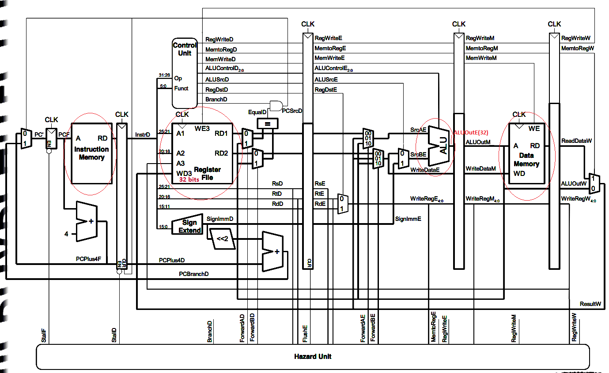

# MIPS-based-Processor 
This is the project of the "Advanced Computer Architecture" course. This project consists of 3 phases:
1: Implement a basic MIPS based processor (baseline)
2: Implement a customized processor; added Dynamic scheduling (for out-of-order execution of commands)
3: Implement Cache and Jump prediction in the CPU

The test code, generates a sequence of numbers in a ascending order, and feeds a sort code to the processor, as well as the numbers, and the processor should correctly 
sort the numbers. The duration of the program is measured.

After the 3rd phase, the speed of execution of the code improved by a factor of 2.22.

## PHASE I
The MIPS based architecture block diagram is as follows:

## PHASE II
The customized processor block diagram is as follows:

